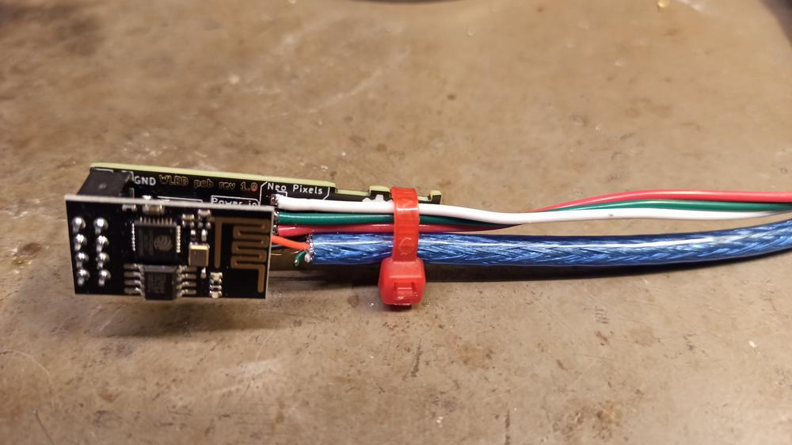

# WLED-Lion workshop and PCB files
Rev 1.1.2

This repository contains the instructions and the PCB files for a soldering and firmware flashing workshop.

Workshop page with parts information: [https://labitat.dk/wiki/Workshops/WLED-lion](https://labitat.dk/wiki/Workshops/WLED-lion)

## WLED Workshop Instructions.

### Part A - Soldering
Link: [Part A](instructions/partA.md)

### Part B - Firmware flashing
Link: [Part B](instructions/partB.md)

### Part C - Software setup and playtime
Link: [Part C](instructions/partC.md)

## Extras
A workshop participant have created a 3D model for 3D printing a box for the finished WLED-Lion LED controller, which can be found at [printables.com](https://www.printables.com/model/343865-wled-lion-box) (Licensed under CC-BY-NC).

Some more ressources:
- WLED [repository link](https://github.com/Aircoookie/WLED)
- WLED [Documentation](https://kno.wled.ge/basics/tutorials/)
- [Sound Reactive version](https://github.com/atuline/WLED) of WLED
  - Only supports ESP32
  - We recommend the INMP441 I2S digital microphone
  - Many built-in options for 2D matrices
- CH340 driver [installation instructions](https://github.com/DecaturMakers/CH340_drivers-Linux-Mac-Windows)

