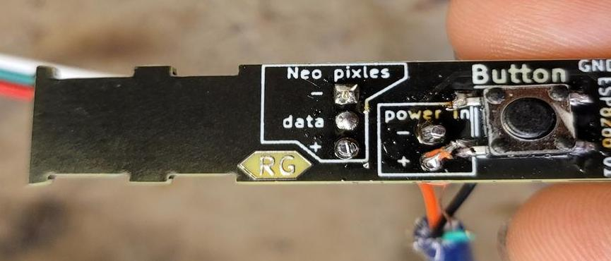
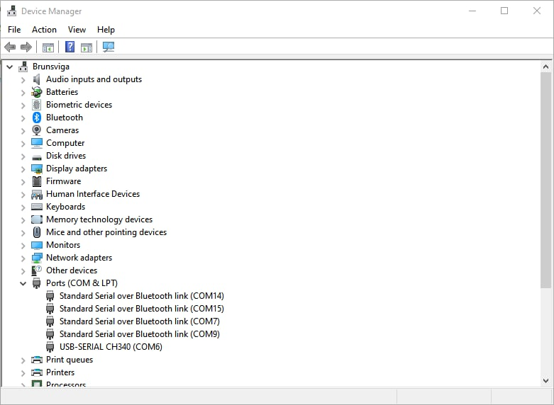

# WLED workshop 

WLED Workshop Instructions.

Rev 1.1


## Part A - Hardware

These are the parts you will be using, what they look like and their names.


A Brief description of parts.
- Pin header			( to hold the ESP8266, and make it easy to remove for programming)
- USB				( just an easy way to power the device once finished)
- Neo Pixel wire		( A way to connect and disconnect the Neo pixel string lights to the PCB)
- cable tie.			( to secure the wires, keep it neat. And protect the wires from being pulled)
- ESP8266			( the brains that control the lights, and host a web page on WiFi)
- PCB				( holds all the components and links them together electrically)


### The PCB
PCB top


PCB bottom


The button is already soldered on for you on the bottom of the PCB. 
There are also some other components pre-soldered onto the PCB, you don't need to worry about them for assembly. 

But if you are interested in what they are, continue reading. 
The “Vreg” is a 3.3v regulator, it takes the 5V from the USB as power in, and converts it down to 3.3v needed to power the ESP8266, as the ESP cannot handle 5V. The 2 smaller components next to it, are 2 capacitors, one between 5V and GND. And one between 3.3V and GND. You can see this more clearly in the schematics. 

The capacitors act like tiny batteries, so if the Neo Pixels or the ESP8266 suddenly draws a lot of current for a short amount of time, the capacitors will supply the extra current, and recharge when they draw less current. Adding the capacitors reduces glitches.

The PCB is mainly made of fiberglass with copper layers on the top and bottom, to electrically connect the components.

### Assembly
#### Step 1
Solder the pin header to the PCB.

It should be mounted on the opposite side of the button. As shown here


I recommend soldering just 1 pin in the corner to start with. Once it's soldered, check the pin header is flat and straight. If it's not you can just heat up that one solder with the iron and carefully push the pin header flat agents the board. 

Once you are happy with the position you can solder the rest of the pins. 


when completed it should look something like this


#### Step 2

Solder the USB to the PCB.  

The USB wire only provides power to the board, so there are only 2 wires to solder.
The ( + ) is the Red wire. And goes in the power + hole on the board.
The ( - ) is the Black wire. And goes in the power–hole on the board. 

**NOTE:** 
The ( - ) wire also has a thin metal wire wrapped around it, this is the GND for the USB’s metal part, it can be ignored as it is wired to the – wire already. 


The 2 wires go into the “power in” section of the PCB. As shown here.
I recommend soldering in 1 wire at a time. 


(**Note:** the wires should not touch each other or anything else. In this example, it's close to the button but not touching, it should be trimmed down to prevent it from touching with side cutters.)

#### Step 3

Solder the Neo Pixel wire to the PCB. 

There are 3 wires. 5V + for the Neo Pixels, - or GND for the Neo Pixel, and Data for the Neo Pixels. 
They are colored and labeled below. 


The correct holes are labeled on the PCB, and should closely match the labeled photo above. 

Another way to help wire it the right way around is the plastic clip on the end of the wire should be on the same side as your pin header for the ESP. And NOT the same side as the button, if it is, seek help.

as the wires are so close together, I would recommend trying to get all 3 to fit in the “Neo Pixel” holes in the PCB, then solder 1 in place to hold the rest. This will make it easier to solder the rest.

Once soldered it should look something like this. 




#### Step 4

Fold both wires back, and cable tie them to the PCB.

 This provides some basic strain relief, so if the wires are pulled for any reason they shouldn't short together or come out. It also makes it a bit neater. 

I recommend making sure theirs a little slack on the USB wire. This can be achieved by putting on the cable tie, then pushing the USB wire back up through it just a bit, till the + and – have a little wiggle to them. 

It will look something like this.


Make sure none of the pins on the back a touching each other. You can also use some wire clippers to trim them down. Notice the Power + wire is almost touching the button, this will be trimmed. 


#### Step 5

If you have already programmed your ESP8266, you can now attach it to the PCB. 
If you have not, you can attach it anyway, so it doesn't get lost in transport. 

Place the ESP8266 in the pin header as shown below. Make sure that non of the pins stick out, every pin has a hole it should go in. It is easy to pull out again and put it back in if it's wrong. 


#### Step 6

If you have got this far, the hardware is now done. YAY!!!

you should now go and Seek Hafnium (Emil) for help programming your ESP8266.
If it's already programmed, then you are ready for testing! 

## Part B: Flash WLED

In this part, we will flash firmware to the ESP01 microcontroller. We will use [ESPtools](https://github.com/espressif/esptool/releases/latest) from Espressif

For your computer to understand which kind of language to speak with the USB device, a driver called **CH340** needs to be installed

### Install firmware
There exists three options:

-   Three options for flashing firmware:
    -   Easy way: Head over to [https://install.wled.me/](https://install.wled.me/) on Chrome (or Chromium) and press install
	    - **However** this only works on devices with 4 MB memory or more, The ESP01S has 1 MB of memory so it is unfortunately not a choice. Therefore other options must be used.
    -   Medium way: Install ESPtools, see below
    -   Difficult way: Use esptools.py with [VSCode](https://code.visualstudio.com/) and the [platform.io](https://platformio.org/) extension , 
	    - This is required if you want to use usermods or compile source code: 

#### Linux
##### Driver
The USB driver **CH340** driver has been included in the Linux kernel since v.2.6.24 from 2008-01-24, so that should not be a problem.

###### ESPtools
On most systems it can be installed with:
```bash
pip install esptool
```

If Python is not installed, do:
```bash
sudo apt install python3 python3-pip
pip install esptool
```

###### Arch
Install with:
```bash
sudo pacman -S esptool
```

###### Debian
install with:
```bash
sudo apt install esptool
```

#### Verify USB device and its required driver are detected
Run the following command
```bash
sudo dmesg -we
```

Now plug in the programmer. The output should look similar to this
```Output
[Oct12 20:50] usb 1-4: new full-speed USB device number 17 using xhci_hcd
[  +0,141709] usb 1-4: New USB device found, idVendor=1a86, idProduct=7523, bcdDevice= 2.54
[  +0,000014] usb 1-4: New USB device strings: Mfr=0, Product=2, SerialNumber=0
[  +0,000007] usb 1-4: Product: USB2.0-Ser!
[  +0,003645] ch34x 1-4:1.0: ch34x converter detected
[  +0,000737] usb 1-4: ch34x converter now attached to ttyUSB0
```
If your output is missing the last two lines, then fetch the [PlatformIO udev rules ](https://docs.platformio.org/en/stable//core/installation/udev-rules.html) and follow the instructions on the site.


#### Windows
##### Driver
To install the CH340 driver head over to the WCH's [english translated website](http://www.wch-ic.com/downloads/CH341SER_ZIP.html)
Download the file called `CH341SER.EXE`
Execute file

##### ESPtool
- Download the programming tool from  [here](https://github.com/espressif/esptool/releases/latest)
- Extract the zip file (install [7zip](https://www.7-zip.org/) you do not have a program for it)
- Open a terminal in the directory containing `esptool.exe`

#### Mac
Install [Homebrew](https://brew.sh/)

1. Open the [Terminal](https://raw.githubusercontent.com/DecaturMakers/CH340_drivers-Linux-Mac-Windows/master/drivers/macos/Terminal.png) (use [Spotlight](https://www.imore.com/how-use-spotlight-mac#use) to find it if you must)
2. If you do not have homebrew, install it.

```bash
/usr/bin/ruby -e "$(curl -fsSL https://github.com/Homebrew/install/raw/master/install)"
```

3. Install the driver. (You will be prompted for the password you use to log in to the Mac.)
```bash
brew tap DecaturMakers/CH340_drivers-Linux-Mac-Windows https://github.com/DecaturMakers/CH340_drivers-Linux-Mac-Windows brew cask install wch-ch34x-usb-serial-driver
```

4. Install ESPtool
```bash
brew install esptool
```

## Flash firmware to ESP
- Download the latest [WLED ESP01 binary](https://github.com/Aircoookie/WLED//releases/latest)
- Plug an ESP01 into the programmer
- Insert the programmer into a USB-A port 


The flashing command is similar for all operating systems with a few variances
### Linux and Mac

```bash
esptool.py write_flash 0x0 WLED_0.13.3_ESP01.bin
```
esptool can auto-detect the port, but it can be specified with the  `-p` flag. The ports are usually `/dev/ttyUSB0` or `/dev/ttyACM0`.

If esptool connects to the flasher and progresses, then you have successfully flashed firmware


#### Troubleshooting
##### Problem: failed connection in ESPtools:
```bash
esptool.py v4.3  
Found 1 serial ports  
Serial port /dev/ttyUSB0  
Connecting.................  
/dev/ttyUSB0 failed to connect: Could not configure port: (5, 'Input/output error')  
  
A fatal error occurred: Could not connect to an Espressif device on any of the 1 available serial ports.
```

**Solution**: Fetch the PlatformIO udev rules [here](https://docs.platformio.org/en/stable//core/installation/udev-rules.html)  and follow the instructions

#### Problem: esptool not found
If calling the esptool program after successful installation returns the error `esptool not found`. 

**Solution:** The path for python modules has not been set. 
Do:
```bash
echo export PATH="/usr/local/bin:$PATH" >> ~/.bash_profile

source ~/.bash_profile
```

### Windows
```bash
esptool.exe -p COMx write_flash 0x0 WLED_0.13.3_ESP01.bin
```

The com port can be found under the device manager, see the image


If esptool connects to the flasher and progresses, then you have successfully flashed firmware

## Credits
Installation instruction for Windows came from [Sparkfun]()
Installation instructions for Mac came from [Decatur Makers](https://github.com/DecaturMakers/CH340_drivers-Linux-Mac-Windows/blob/master/README.md)


## Part C
#### Step 1
Plug the programmed ESP8266 into the PCB.


#### Step 2
Attach the Neo Pixel strip to the PCB.

#### Step 3
plug the USB into a power supply. ( laptop is fine, or a power bank, or a phone charger )
once plugged in the Neo Pixel strip will light up green, and the ESP8266 will give a small blue flash. And a Red LED will be dimly light on it.  

#### Step 4

Find and join the WLED WiFi. 

(**NOTE:** The WIFI near Labitat is currently very packed, and you might not see your WLED WIFI access point, if that is the case, try moving to another room. Or even outside, with your laptop as a power source for the WLED)

As there are many of you are trying this at once, it's recommended that you wait a bit before you power up your WLED, or try to do it quickly. 

```
Wifi name: WLED 
Password: "wled1234"
```

Once your connected your phone should redirect you to a “login page” if not go to `http://4.3.2.1`

You should see a screen like this 


From here click on “go to the controls” 
now click on a random color on the color wheel and see that YOUR WLED changes to that color. 


If it does not, you are on someone else WLED. If it does congratulations! 

Please go to the options on the top right, and click on “User Interface”
from there change the hostname of the device from “WLED” to something of your choosing. This will help you identify your WLED. 


From here you go click save. Then go back to the main page.
Now the Tab on your browser will be the name you set, This can be helpful if you have multiple WLED devices on the same network. 

You can change the “Effects” and color pallet and generally play around with it. 

From here you can just play around with it. There is lots of great documentation online on settings and things to play with. Or if you are lazy you can ask Richard or Hafnium to show you some cool things, or ask for more details on some parts.

When you get home with this, you can also connect it to your home WiFi. 
I recommend using the WLED app on IOS or Android for easily finding and controlling your WLED devices on your home WiFi. 

**Android app**: [Play store](https://play.google.com/store/apps/details?id=com.aircoookie.WLED&hl=en&gl=US
)

**IOS app**: [App store](https://apps.apple.com/us/app/wled/id1475695033
)

**Documentation**
There is also some great documentation online for changing settings and doing other things with it. [https://kno.wled.ge/basics/tutorials/](https://kno.wled.ge/basics/tutorials/)


