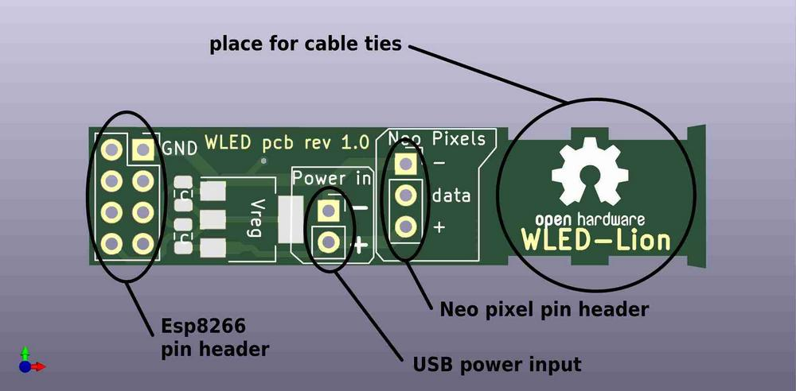
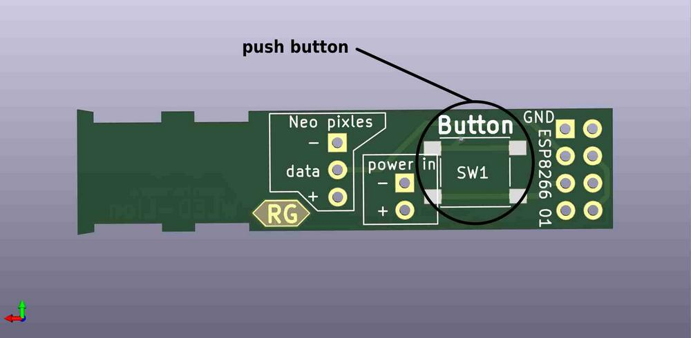
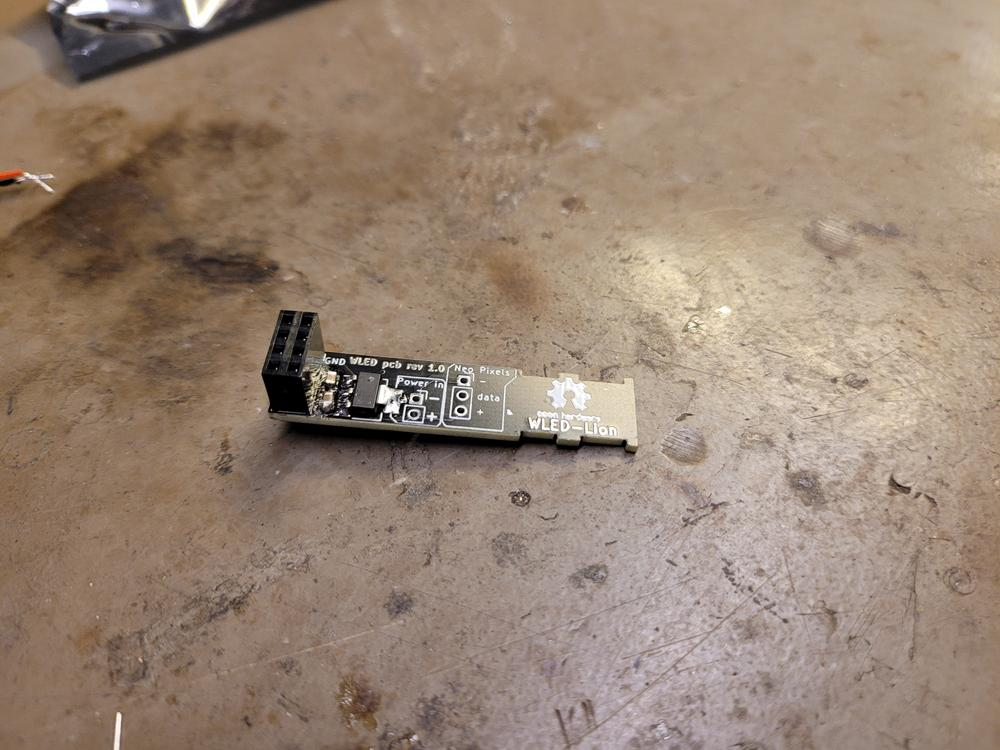
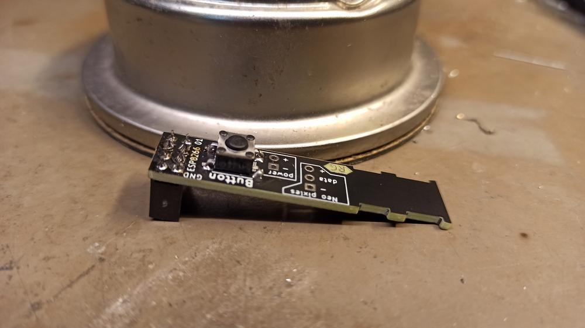
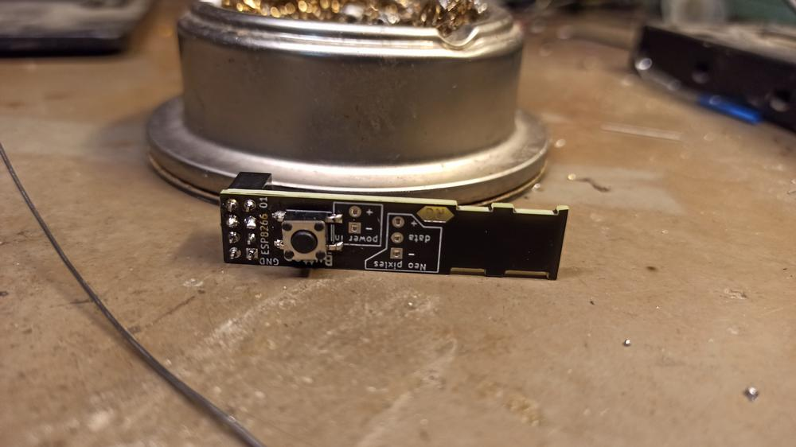
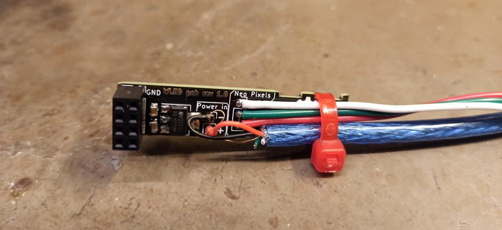

## Part A - Hardware

These are the parts you will be using, what they look like and their names.

A Brief description of parts.
- Pin header			( to hold the ESP8266, and make it easy to remove for programming)
- USB				( just an easy way to power the device once finished)
- Neo Pixel wire		( A way to connect and disconnect the Neo pixel string lights to the PCB)
- cable tie.			( to secure the wires, keep it neat. And protect the wires from being pulled)
- ESP8266			( the brains that control the lights, and host a web page on WiFi)
- PCB				( holds all the components and links them together electrically)

### The PCB
PCB top

PCB bottom

The button is already soldered on for you on the bottom of the PCB. 
There are also some other components pre-soldered onto the PCB, you don't need to worry about them for assembly. 

But if you are interested in what they are, continue reading. 
The “Vreg” is a 3.3v regulator, it takes the 5V from the USB as power in, and converts it down to 3.3v needed to power the ESP8266, as the ESP cannot handle 5V. The 2 smaller components next to it, are 2 capacitors, one between 5V and GND. And one between 3.3V and GND. You can see this more clearly in the schematics. 

The capacitors act like tiny batteries, so if the Neo Pixels or the ESP8266 suddenly draws a lot of current for a short amount of time, the capacitors will supply the extra current, and recharge when they draw less current. Adding the capacitors reduces glitches.

The PCB is mainly made of fiberglass with copper layers on the top and bottom, to electrically connect the components.

### Assembly
#### Step 1
Solder the pin header to the PCB.

It should be mounted on the opposite side of the button. As shown here

I recommend soldering just 1 pin in the corner to start with. Once it's soldered, check the pin header is flat and straight. If it's not you can just heat up that one solder with the iron and carefully push the pin header flat agents the board. 

Once you are happy with the position you can solder the rest of the pins. 

when completed it should look something like this

#### Step 2

Solder the USB to the PCB.  

The USB wire only provides power to the board, so there are only 2 wires to solder.
The ( + ) is the Red wire. And goes in the power + hole on the board.
The ( - ) is the Black wire. And goes in the power–hole on the board. 

**NOTE:** 
The ( - ) wire also has a thin metal wire wrapped around it, this is the GND for the USB’s metal part, it can be ignored as it is wired to the – wire already. 

The 2 wires go into the “power in” section of the PCB. As shown here.
I recommend soldering in 1 wire at a time. 

(**Note:** the wires should not touch each other or anything else. In this example, it's close to the button but not touching, it should be trimmed down to prevent it from touching with side cutters.)

#### Step 3

Solder the Neo Pixel wire to the PCB. 

There are 3 wires. 5V + for the Neo Pixels, - or GND for the Neo Pixel, and Data for the Neo Pixels. 
They are colored and labeled below. 

The correct holes are labeled on the PCB, and should closely match the labeled photo above. 

Another way to help wire it the right way around is the plastic clip on the end of the wire should be on the same side as your pin header for the ESP. And NOT the same side as the button, if it is, seek help.

as the wires are so close together, I would recommend trying to get all 3 to fit in the “Neo Pixel” holes in the PCB, then solder 1 in place to hold the rest. This will make it easier to solder the rest.

Once soldered it should look something like this. 

#### Step 4

Fold both wires back, and cable tie them to the PCB.

 This provides some basic strain relief, so if the wires are pulled for any reason they shouldn't short together or come out. It also makes it a bit neater. 

I recommend making sure theirs a little slack on the USB wire. This can be achieved by putting on the cable tie, then pushing the USB wire back up through it just a bit, till the + and – have a little wiggle to them. 

It will look something like this.

Make sure none of the pins on the back a touching each other. You can also use some wire clippers to trim them down. Notice the Power + wire is almost touching the button, this will be trimmed. 

#### Step 5

If you have already programmed your ESP8266, you can now attach it to the PCB. 
If you have not, you can attach it anyway, so it doesn't get lost in transport. 

Place the ESP8266 in the pin header as shown below. Make sure that non of the pins stick out, every pin has a hole it should go in. It is easy to pull out again and put it back in if it's wrong. 

#### Step 6

If you have got this far, the hardware is now done. YAY!!!

you should now go and Seek Hafnium (Emil) for help programming your ESP8266.
If it's already programmed, then you are ready for testing! 

## Done!
Now head over to [Part B](./partB.md).