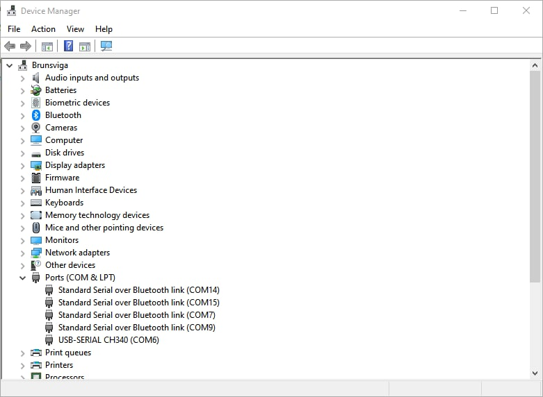

## Part B: Flash WLED

In this part, we will flash firmware to the ESP01 microcontroller. We will use [ESPtools](https://github.com/espressif/esptool/releases/latest) from Espressif

For your computer to understand which kind of language to speak with the USB device, a driver called **CH340** needs to be installed

### Install firmware
There exists three options:

-   Three options for flashing firmware:
    -   Easy way: Head over to [https://install.wled.me/](https://install.wled.me/) on Chrome (or Chromium) and press install
	    - **However** this only works on devices with 4 MB memory or more, The ESP01S has 1 MB of memory so it is unfortunately not a choice. Therefore other options must be used.
    -   Medium way: Install ESPtools, see below
    -   Difficult way: Use esptools.py with [VSCode](https://code.visualstudio.com/) and the [platform.io](https://platformio.org/) extension , 
	    - This is required if you want to use usermods or compile source code: 

#### Linux
##### Driver
The USB driver **CH340** driver has been included in the Linux kernel since v.2.6.24 from 2008-01-24, so that should not be a problem.

###### ESPtools
On most systems it can be installed with:
```bash
pip install esptool
```

If Python is not installed, do:
```bash
sudo apt install python3 python3-pip
pip install esptool
```

###### Arch
Install with:
```bash
sudo pacman -S esptool
```

###### Debian
install with:
```bash
sudo apt install esptool
```

#### Verify USB device and its required driver are detected
Run the following command
```bash
sudo dmesg -we
```

Now plug in the programmer. The output should look similar to this
```Output
[Oct12 20:50] usb 1-4: new full-speed USB device number 17 using xhci_hcd
[  +0,141709] usb 1-4: New USB device found, idVendor=1a86, idProduct=7523, bcdDevice= 2.54
[  +0,000014] usb 1-4: New USB device strings: Mfr=0, Product=2, SerialNumber=0
[  +0,000007] usb 1-4: Product: USB2.0-Ser!
[  +0,003645] ch34x 1-4:1.0: ch34x converter detected
[  +0,000737] usb 1-4: ch34x converter now attached to ttyUSB0
```
If your output is missing the last two lines, then fetch the [PlatformIO udev rules ](https://docs.platformio.org/en/stable//core/installation/udev-rules.html) and follow the instructions on the site.


#### Windows
##### Driver
To install the CH340 driver head over to the WCH's [english translated website](http://www.wch-ic.com/downloads/CH341SER_ZIP.html)
Download the file called `CH341SER.EXE`
Execute file

##### ESPtool
- Download the programming tool from  [here](https://github.com/espressif/esptool/releases/latest)
- Extract the zip file (install [7zip](https://www.7-zip.org/) you do not have a program for it)
- Open a terminal in the directory containing `esptool.exe`

#### Mac
Install [Homebrew](https://brew.sh/)

1. Open the [Terminal](https://raw.githubusercontent.com/DecaturMakers/CH340_drivers-Linux-Mac-Windows/master/drivers/macos/Terminal.png) (use [Spotlight](https://www.imore.com/how-use-spotlight-mac#use) to find it if you must)
2. If you do not have homebrew, install it.

```bash
/usr/bin/ruby -e "$(curl -fsSL https://github.com/Homebrew/install/raw/master/install)"
```

3. Install the driver. (You will be prompted for the password you use to log in to the Mac.)
```bash
brew tap DecaturMakers/CH340_drivers-Linux-Mac-Windows https://github.com/DecaturMakers/CH340_drivers-Linux-Mac-Windows brew cask install wch-ch34x-usb-serial-driver
```

4. Install ESPtool
```bash
brew install esptool
```

## Flash firmware to ESP
- Download the latest [WLED ESP01 binary](https://github.com/Aircoookie/WLED//releases/latest) called `WLED_0.14.0-b1_ESP01.bin`
- Plug an ESP01 into the programmer
- Insert the programmer into a USB-A port 


The flashing command is similar for all operating systems with a few variances
### Linux and Mac

```bash
esptool.py write_flash 0x0 WLED_0.14.0-b1_ESP01.bin 
```
esptool can auto-detect the port, but it can be specified with the  `-p` flag. The ports are usually `/dev/ttyUSB0` or `/dev/ttyACM0`.

If esptool connects to the flasher and progresses, then you have successfully flashed firmware


#### Troubleshooting
##### Problem: failed connection in ESPtools:
```bash
esptool.py v4.3
Found 1 serial ports  
Serial port /dev/ttyUSB0  
Connecting.................  
/dev/ttyUSB0 failed to connect: Could not configure port: (5, 'Input/output error')  
  
A fatal error occurred: Could not connect to an Espressif device on any of the 1 available serial ports.
```

**Solution**: Fetch the PlatformIO udev rules [here](https://docs.platformio.org/en/stable//core/installation/udev-rules.html)  and follow the instructions

#### Problem: esptool not found
If calling the esptool program after successful installation returns the error `esptool not found`. 

**Solution:** The path for python modules has not been set. 
Do:
```bash
echo export PATH="/usr/local/bin:$PATH" >> ~/.bash_profile

source ~/.bash_profile
```

### Windows
```bash
esptool.exe -p COMx write_flash 0x0 WLED_0.14.0-b1_ESP01.bin
```

The com port can be found under the device manager, see the image


If esptool connects to the flasher and progresses, then you have successfully flashed firmware

## Done!
Now head over to [Part C](./partC.md).

## Credits
- Installation instruction for Windows came from [Sparkfun]()
- Installation instructions for Mac came from [Decatur Makers](https://github.com/DecaturMakers/CH340_drivers-Linux-Mac-Windows/blob/master/README.md)

