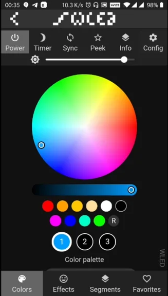
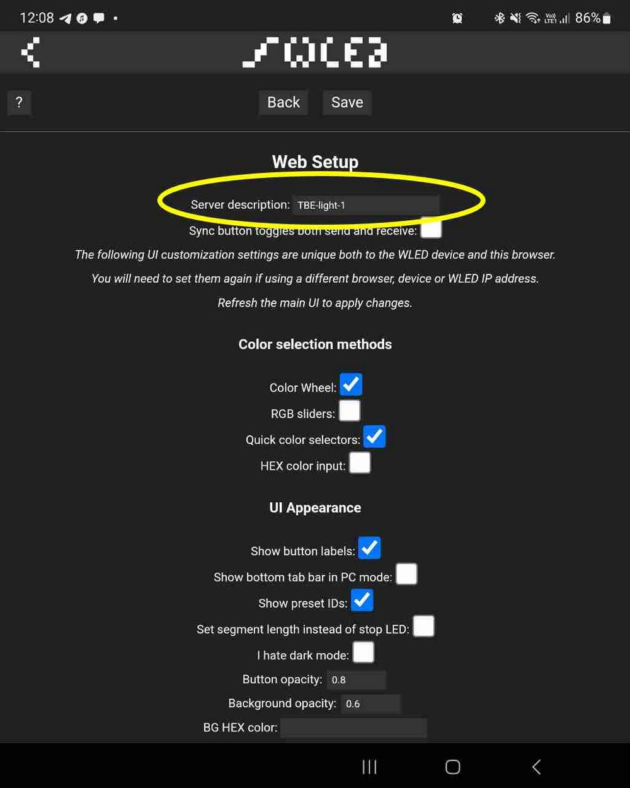

## Part C
#### Step 1
Plug the programmed ESP8266 into the PCB.


#### Step 2
Attach the Neo Pixel strip to the PCB.

#### Step 3
plug the USB into a power supply. ( laptop is fine, or a power bank, or a phone charger )
once plugged in the Neo Pixel strip will light up green, and the ESP8266 will give a small blue flash. And a Red LED will be dimly light on it.  

#### Step 4

Find and join the WLED WiFi. 

(**NOTE:** The WIFI near Labitat is currently very packed, and you might not see your WLED WIFI access point, if that is the case, try moving to another room. Or even outside, with your laptop as a power source for the WLED)

As there are many of you are trying this at once, it's recommended that you wait a bit before you power up your WLED, or try to do it quickly. 

```
Wifi name: WLED 
Password: "wled1234"
```

Once your connected your phone should redirect you to a “login page” if not go to `http://4.3.2.1`

You should see a screen like this 


From here click on “go to the controls” 
now click on a random color on the color wheel and see that YOUR WLED changes to that color. 



If it does not, you are on someone else WLED. If it does congratulations! 

Please go to the options on the top right, and click on “User Interface”
from there change the hostname of the device from “WLED” to something of your choosing. This will help you identify your WLED. 




From here you go click save. Then go back to the main page.
Now the Tab on your browser will be the name you set, This can be helpful if you have multiple WLED devices on the same network. 

You can change the “Effects” and color pallet and generally play around with it. 

From here you can just play around with it. There is lots of great documentation online on settings and things to play with. Or if you are lazy you can ask Richard or Hafnium to show you some cool things, or ask for more details on some parts.

When you get home with this, you can also connect it to your home WiFi. 
I recommend using the WLED app on IOS or Android for easily finding and controlling your WLED devices on your home WiFi. 

**Android app**: [Play store](https://play.google.com/store/apps/details?id=com.aircoookie.WLED&hl=en&gl=US
)

**IOS app**: [App store](https://apps.apple.com/us/app/wled/id1475695033
)

**Documentation**
There is also some great documentation online for changing settings and doing other things with it. [https://kno.wled.ge/basics/tutorials/](https://kno.wled.ge/basics/tutorials/)


## Done!
It is time to play around with your WiFi connected lights.